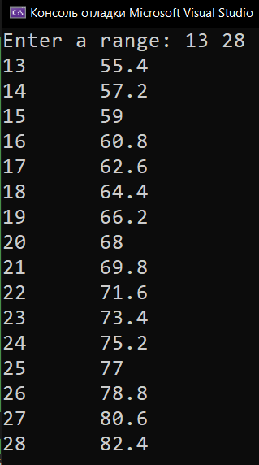
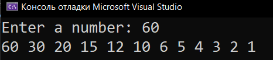
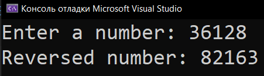

# Homework_10_Loop
Д/з: Loop

<a href="https://gist.github.com/SlavikArt/6706b3b2cf5aa3afe40980728bb88fb2">Gist - страница со всеми кодами проектов</a>

* [Celsius_To_Fahrenheit](Celsius_To_Fahrenheit)
* [Division_Without_Remainder](Division_Without_Remainder)
* [Reverse_A_Number](Reverse_A_Number)

    <h2>Celsius to fahrenheit</h2>
    
Celsius to fahrenheit

    
    <h2>Division without remainder</h2>
    
Division without remainder

    
    <h2>Reverse a number</h2>
    
Reverse a number

    

